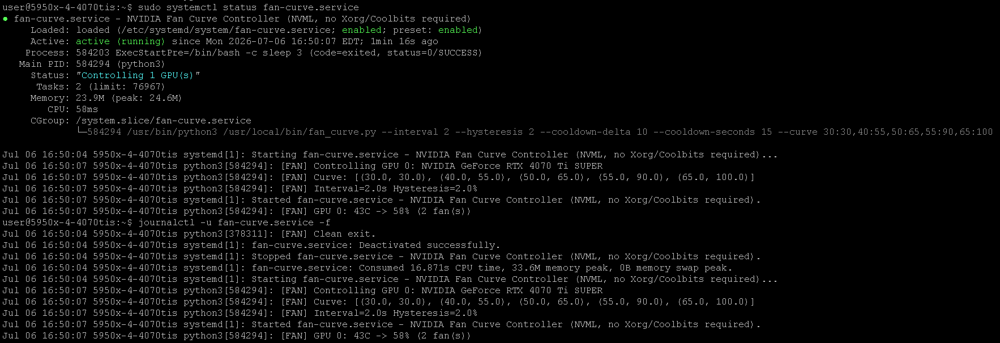

[Get started](https://github.com/greenfirn/RigControl#get-started)

-- service status, log -- developed with help from and description by claude.ai



-- credit to https://github.com/Akisoft41/py-nvtool for py-nvtool fan control --

# NVML Fan Curve

A lightweight, headless NVIDIA fan curve controller that talks to the driver directly
through NVML (`libnvidia-ml.so`) — no `nvidia-settings`, no X server, no Coolbits,
and no dependency on the GPU being idle to get manual fan control.

## Why this exists

The usual way to get custom fan curves on Linux (`nvidia-settings -a GPUTargetFanSpeed=...`)
requires a running X server with `Coolbits` enabled via `NV-CONTROL`. On headless mining/compute
rigs that means standing up a fake Xorg instance just for fan control — and under heavy
sustained compute load, repeated NV-CONTROL calls can destabilize the GPU's GSP firmware
(observed as Xid 109/119/154 errors).

This project instead calls `nvmlDeviceSetFanSpeed_v2` directly via `ctypes`, the same
interface `nvidia-smi` itself uses. No X server required, and it works identically whether
the GPU is idle or fully loaded.

## Files - py-nvtool/

| File | Purpose |
|---|---|
| `nvtool.py` | Python NVML bindings + a small standalone CLI (query/set clocks, power limit, fan speed per GPU). Imported as a library by `fan_curve.py`. |
| `fan_curve.py` | The fan curve daemon. Polls GPU temps on an interval and drives fan speed via NVML according to a configurable temp→fan% curve. |
| `fan-curve.service` | systemd unit to run the daemon on boot, with clean shutdown (resets fans to AUTO on stop). |
| `install_fan-curve.sh` | One-time full setup for a new rig: writes `fan_curve.py` and `fan-curve.service`, enables and starts the service. |
| `fan_curve.sh` | Standalone script that just (re)writes `/usr/local/bin/fan_curve.py`. Re-run this alone when the daemon's Python logic changes, without touching the service config. |
| `fan-curve_service.sh` | Standalone script that just (re)writes `fan-curve.service` and reloads/restarts it. Re-run this alone to tweak `--curve`, `--hysteresis`, `--cooldown-*`, etc. per rig. |

## Requirements

- NVIDIA driver installed (provides `libnvidia-ml.so.1`) — no Xorg/Coolbits required
- Python 3 (stdlib only — no `pip install` needed)
- Root privileges (fan-speed writes require it)
- Recommended: NVIDIA persistence mode enabled (`nvidia-persistenced`) for stable driver state

## Install

**New rig — setup:**

```bash
# create nvtool.py and copy in text
sudo nano /usr/local/bin/nvtool.py

or

# copy nvtool.py to rig
pscp "C:\Users\-windows-username-\Downloads\nvtool.py" user@rig-ip:/home/user/nvtool.py

# copy on rig into place...
sudo cp -v /home/user/nvtool.py /usr/local/bin/nvtool.py

```

`fan-curve_service.sh` rewrites the systemd unit and reloads/restarts it —
edit the `--curve` (and other flags) in that script before running it.

## Usage - manual testing

```bash
sudo python3 fan_curve.py                                  # all GPUs, default curve
sudo python3 fan_curve.py --index 0                         # GPU 0 only
sudo python3 fan_curve.py --curve "30:30,40:55,50:65,55:90,65:100"
```

### CLI flags

| Flag | Default | Description |
|---|---|---|
| `--index` | `-1` (all GPUs) | GPU index to control, or `-1` for all |
| `--interval` | `2` | Seconds between temperature checks |
| `--hysteresis` | `2` | Minimum fan% change required before re-issuing a fan-speed write, prevents fan "hunting" on small temp noise |
| `--curve` | `30:30,40:55,50:65,55:90,65:100` | Temp(°C):Fan(%) points, comma-separated, linearly interpolated between points |
| `--cooldown-delta` | `10` | Temp drop (°C) below the recent peak that triggers a hold before lowering the fan. `0` disables holding. |
| `--cooldown-seconds` | `15` | How long a drop must persist before the fan is actually lowered |

**Cooldown hold** debounces fan *decreases* specifically: if temp dips ≥`--cooldown-delta`
below its recent peak, the fan holds at its current (higher) speed for
`--cooldown-seconds` before actually dropping — and cancels immediately if temp climbs
back up in the meantime. Fan *increases* are always applied instantly, no delay.

### Editing the fan curve

The curve is set in `fan-curve_service.sh`'s `ExecStart` line. Edit the `--curve`
value in that script, then re-run it:

```bash
sudo bash fan-curve_service.sh

```

This rewrites `fan-curve.service`, reloads systemd, and restarts the daemon —
no need to touch `nvtool.py` or `fan_curve.py`.

On `systemctl stop`/`restart`, fans are reset to automatic control before exit:

```
[FAN] Shutdown requested, resetting fans to AUTO...
[FAN] GPU 0: reset 2 fan(s) to AUTO
[FAN] Clean exit.
```

## Troubleshooting

| Symptom | Likely cause |
|---|---|
| `nvmlInit failed` | NVIDIA driver not installed, or `libnvidia-ml.so.1` not on the library path |
| `WARN fan-set failed (Not Supported)` | GPU/driver combo doesn't allow manual fan override via NVML |
| `WARN could not reset to auto` | Same as above — `nvmlDeviceSetDefaultFanSpeed_v2` unsupported on that card |
| No log output at all | Missing `PYTHONUNBUFFERED=1` in the unit file |
| Fans "hunt" up/down rapidly | Increase `--hysteresis` |

## License / attribution

`nvtool.py` includes NVIDIA's official pynvml bindings (BSD-3-Clause,
© NVIDIA Corporation) plus a small custom CLI built on top. `fan_curve.py` and
`fan-curve.service` are original to this project.
