# RigControl - Dashboard

A self-hosted rig monitoring dashboard for Ubuntu Server / Windows rigs, Clore AI, Octaspace, Salad Hosts etc. Built with a Python telemetry agent, MQTT-based dashboard server, and a webpage frontend.

--> [Design](#design)

Dashboard... Docker / miner details popout
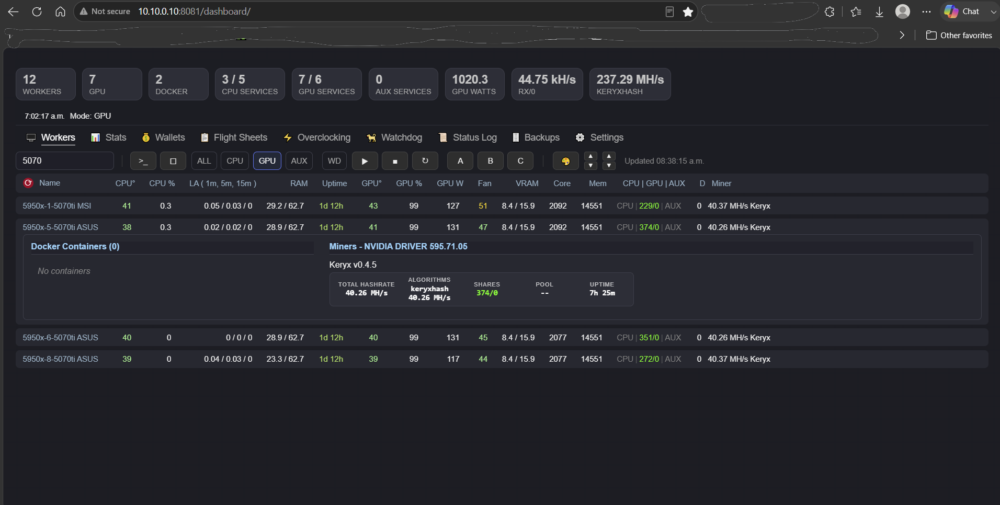

Flightsheets... Apply to
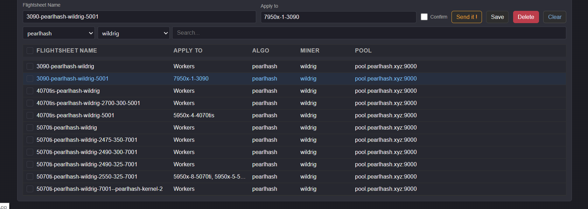

# Work in progress...

>
> added centered layout by default, toggle left/center in themes
>
> agent safe guard: MIN_TELEMETRY_PULL_INTERVAL_SECONDS=5
>
> watchdog not tested, don't really have use for it
>
> Advanced Server Settings in dashboard
>
> 3 services can now be controlled through dashboard CPU/GPU/AUX
>
> stats is now sent to dashboard in chunks to avoid hitting a size limit
>
> new coin textbox to set a coin name in json for 'to clipboard'
>
> windows agent notes for running services, not tested
>

# Get started

* [rigcontrol_dashboard_server_windows](rigcontrol_dashboard_server_windows)

* [rigcontrol_dashboard_server_pi](rigcontrol_dashboard_server_pi)

* [static](static)

* [rigcontrol_agent](rigcontrol_agent)

* [Miner-scripts](Miner-scripts)

* [Docker-Events](Miner-scripts/Docker-Events)

* [Overclocks](Overclocks)

* [Fan-control](Fan-control)

* [themes](themes)

X-files
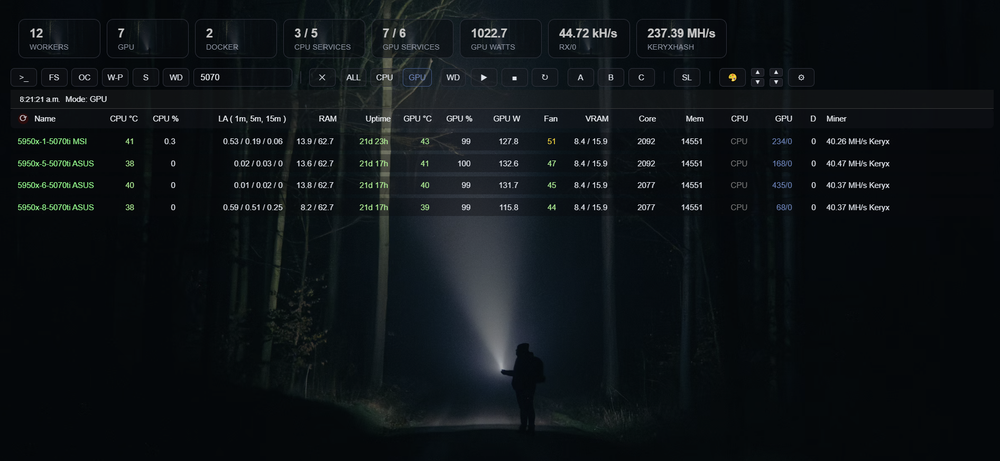

Fallout
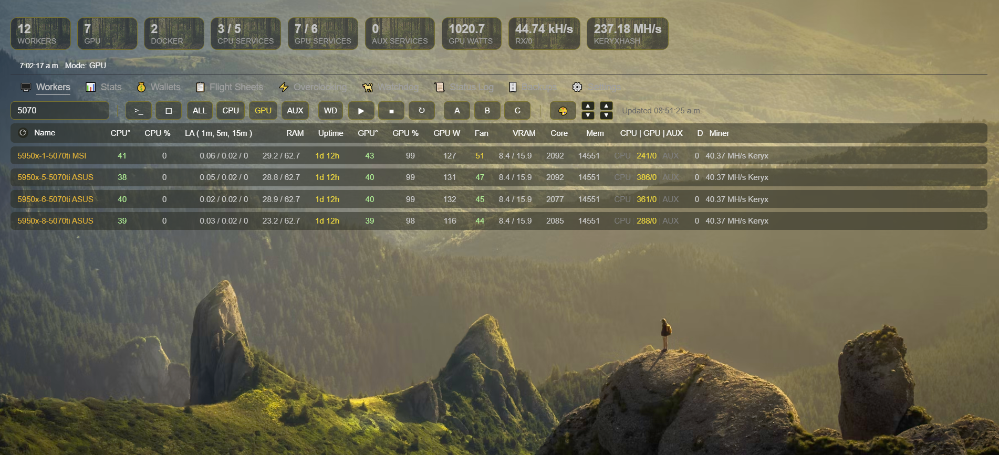

Alien
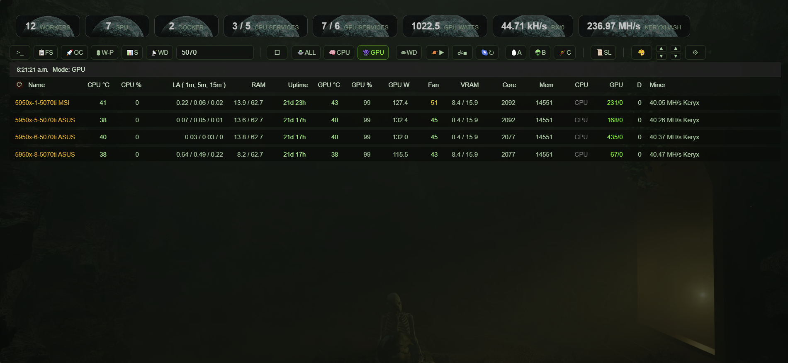

Phantom Menace
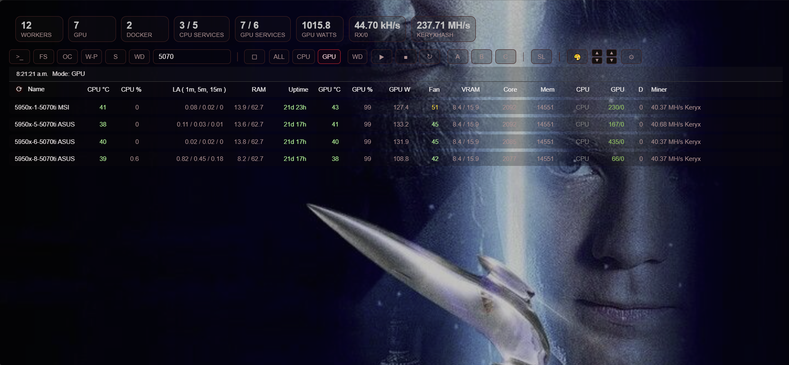

# Design:

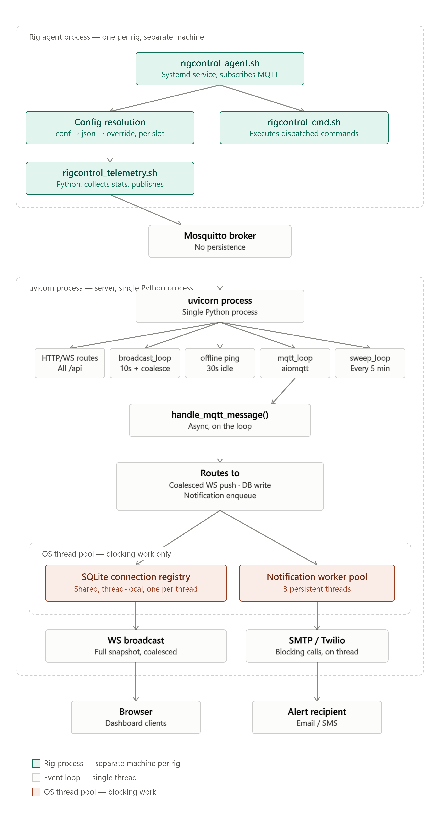

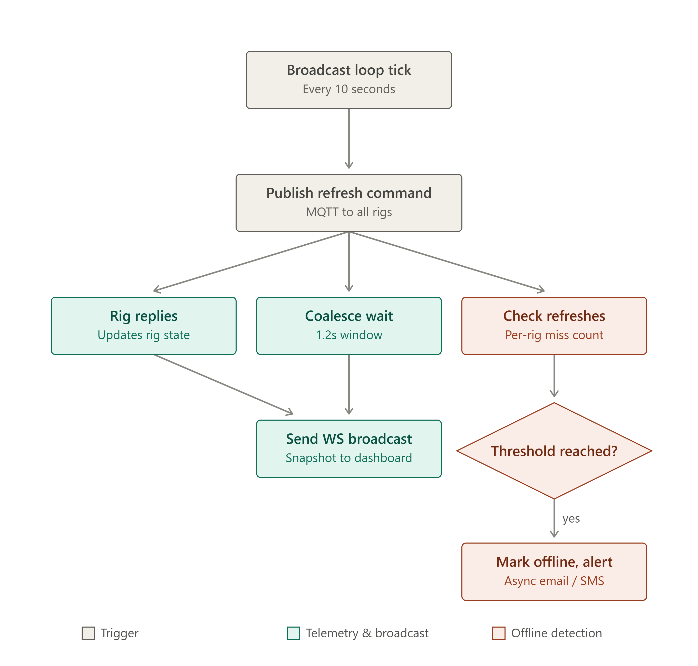

Render tuning... Advanced Server Settings
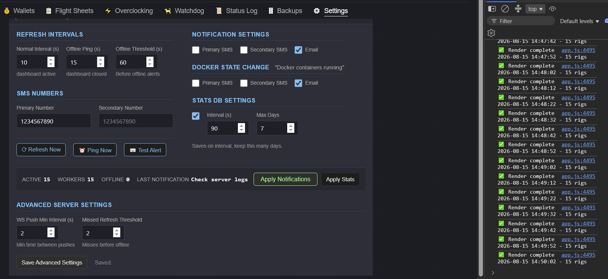

Themes... saved to browser data, profiles save on server
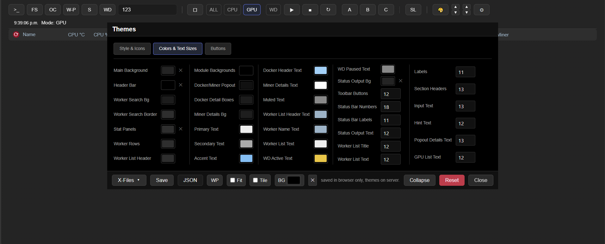

Multi-gpu pane in details popout, main list shows total watts, highest temp, highest watts, etc
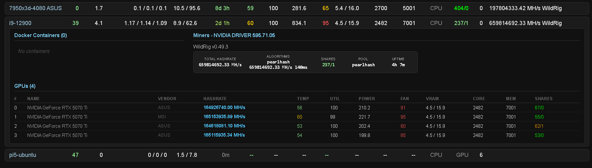

Search workers multi term coma seperated
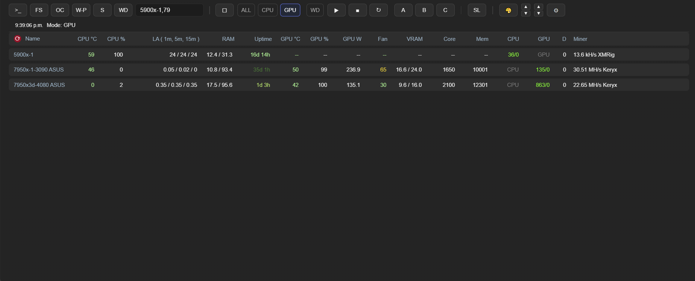

Rig Statistics -- saves to rig local db, skip gpu stats with override rules still apply
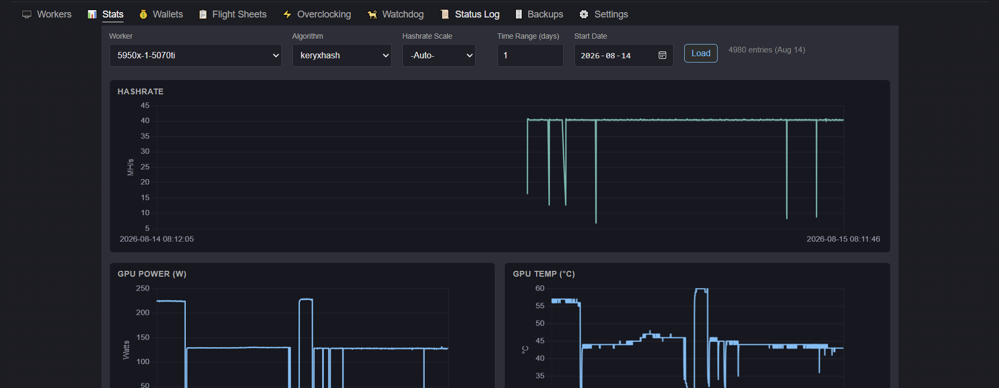
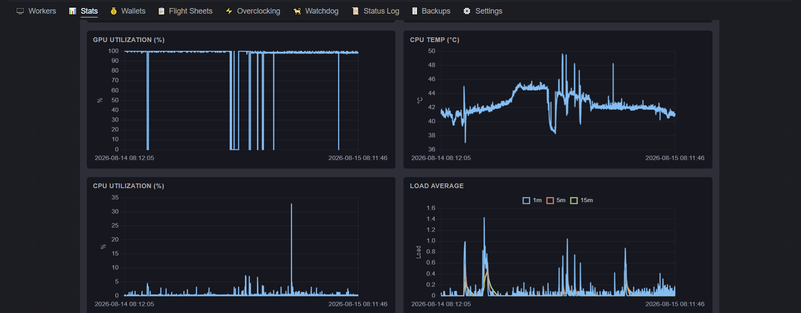

Remote access view only mode... with email unlock [2FA.md](rigcontrol_dashboard_server_pi/2FA.md)
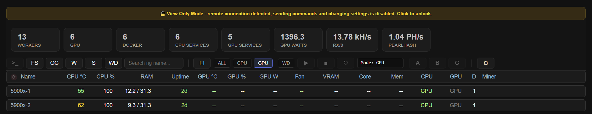

Unlock... 3 attempts per 24h, 60 second sleep
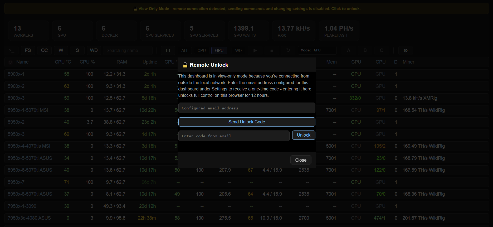

Unlock email...
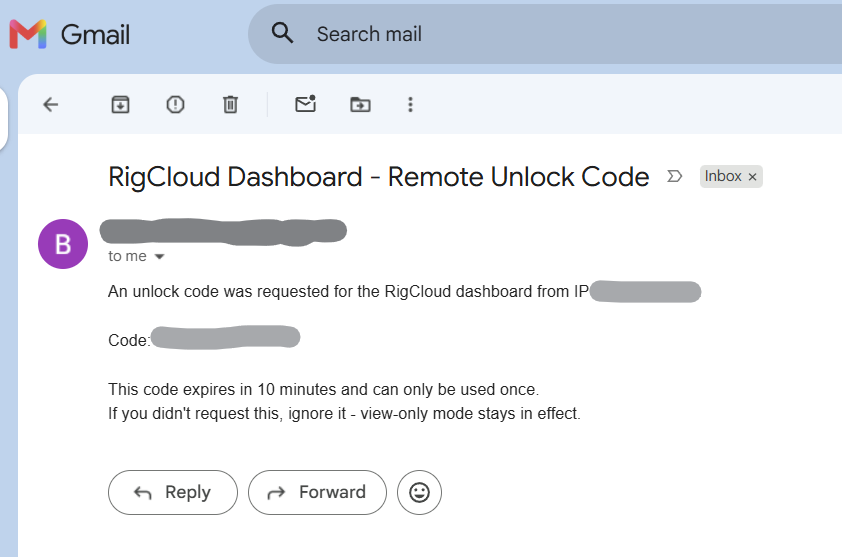

[RigControl - Dashboard](#rigcontrol---dashboard)

[Get started](#get-started)
